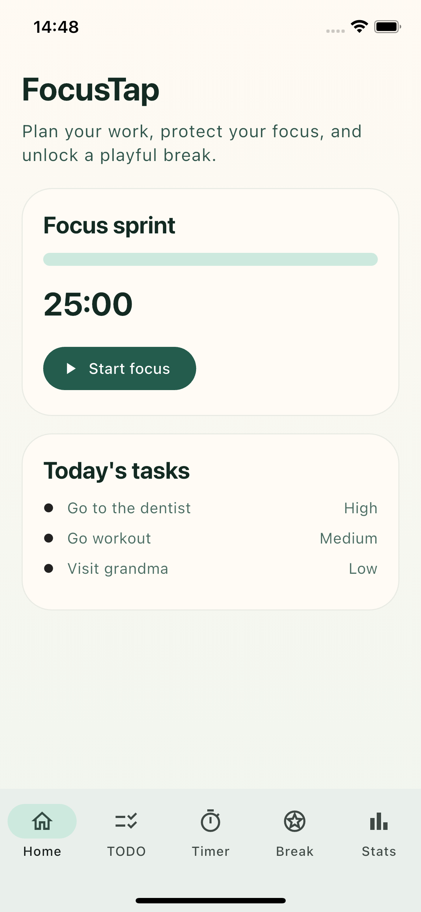
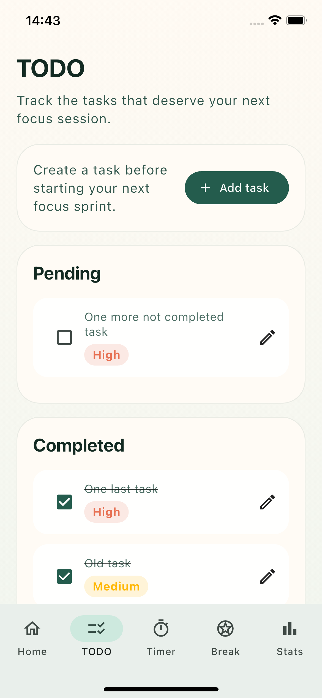
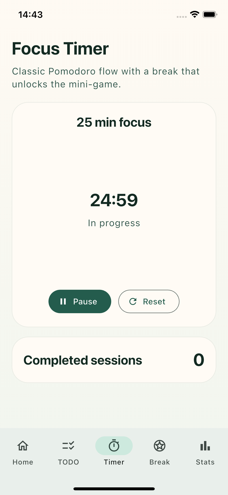
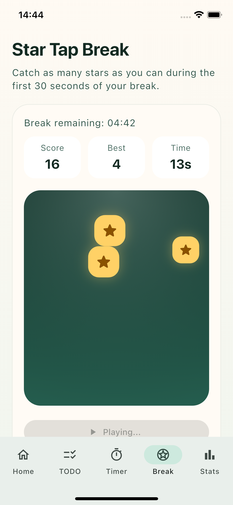
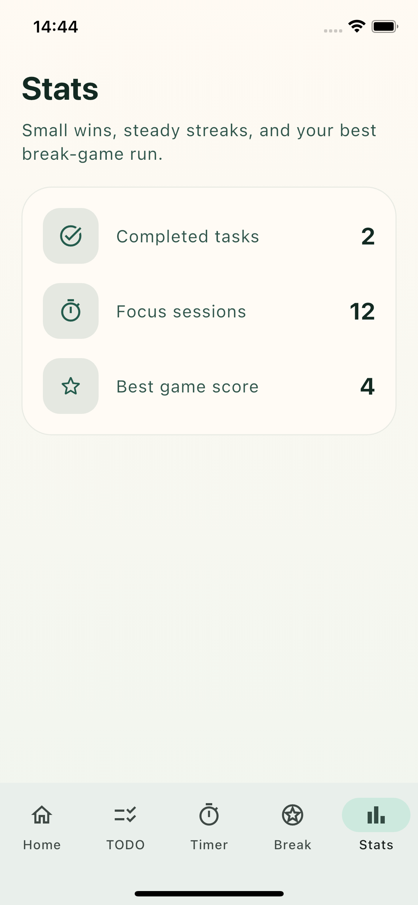

# 🎯 Focus Tap

**Focus Tap** is a premium, gamified productivity app built with Flutter. It combines a robust Pomodoro-style focus timer with a fast-paced "Star Tap" break game and a task manager, ensuring you stay productive while rewarding your focus.

<p align="center">
  
</p>

---

## 🌟 Features

- **🚀 Deep Work Timer**: A clean, distraction-free timer to manage your sessions.
- **✅ Task Management**: Integrated Todo list to organize your daily goals.
- **⭐ Star Tap Break**: A high-intensity mini-game that unlocks only during breaks. Catch exploding stars and beat your high score!
- **📊 Focus Analytics**: A dedicated stats dashboard tracking your focus sessions, completed tasks, and game performance.
- **🎨 Premium UI/UX**: Sleek glassmorphism, fluid animations (Hero transitions, custom shapes), and a sophisticated Emerald & Gold color palette.
- **💾 Local Persistence**: All your progress, tasks, and scores are saved locally on your device.

---

## 📂 Project Structure

The project follows a clean BLoC-based architecture, separating business logic from UI.

```text
lib/
├── app/            # App initialization, themes, and global constants.
├── cubits/         # State management using Cubit (Timer, Game, Tasks, Stats).
├── models/         # Data models (TaskItems, Game entities).
├── repositories/   # Data layer for local storage interactions.
├── view/           # UI Layer.
│   ├── screens/    # Main application screens (Home, Timer, Stats, Game).
│   └── widgets/    # Reusable UI components.
└── main.dart       # Entry point.
```

---

## 🛠 Tech Stack

- **Framework**: [Flutter](https://flutter.dev) (Dart)
- **State Management**: [Cubit (Flutter BLoC)](https://pub.dev/packages/flutter_bloc)
- **Persistence**: [Shared Preferences](https://pub.dev/packages/shared_preferences)
- **Tools**: Flutter Native Splash, Launcher Icons, Build Runner.

---

## 🚀 Getting Started

Follow these steps to set up and run Focus Tap on your local machine.

### Prerequisites
* **Flutter SDK** installed.
* A functional **IDE** (VS Code, Android Studio, etc.).

### Installation

1. **Clone the repository**:
   ```sh
   git clone <repository-url>
   ```

2. **Install dependencies**:
   ```sh
   flutter pub get
   ```

3. **Run the application**:
   ```sh
   flutter run
   ```

---

## 📸 Screenshots

| Home Screen | ToDo List Screen | Focus Timer Screen | Break Game Screen | Statistics Screen |
|:---:|:---:|:---:|:---:|:---:|
|  |  |  |  |  |


## 🎥 Video Demonstration

*(Coming Soon / Add link here)*
<!--  -->

---

